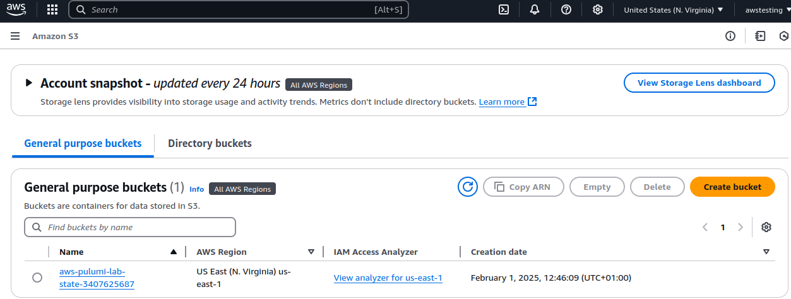

Pulumi permite gestionar los estados a través de diferentes maneras: desde su web, desde un bucket S3, Azure blob, etc.

En este caso se va a configurar un bucket S3. Entonces, el primer paso es crear un bucket S3 en AWS de forma manual (por ahora no interesa gestionarlo vía IaC)

```
aws s3api create-bucket \
	--bucket aws-pulumi-lab-state-3407625687 \
	--profile awstesting
```

> [!warning]
> Es importante para que el comando `aws s3api`no de error tener instalado el paquete `less`

Si ahora se listan los buckets disponible debe aparecer el que se ha creado
```
aws s3 ls --profile awstesting  
2025-02-01 12:46:09 aws-pulumi-lab-state-3407625687
```

En la consola también aparecerá


